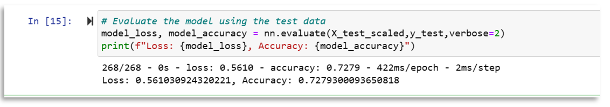
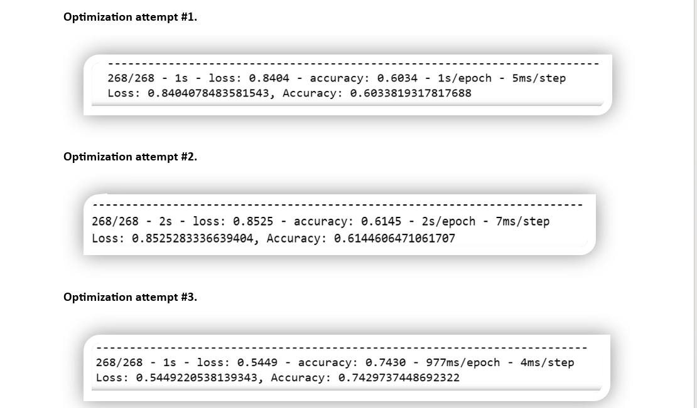

# Neural Network Model Report

1. **Overview** 
    The nonprofit foundation ***Alphabet Soup*** wants a tool that can help it select the applicants for funding with the best chance of success in their ventures. So, we created a deep-learning neural networks, and used the features in the provided dataset to create a binary classifier that can predict whether applicants will be successful if funded by ***Alphabet Soup***.

2. **Results:** 
    * Data Preprocessing
        * **What variable(s) are the target(s) for your model?**  
         The target variable for our model is the `IS_SUCCESSFUL` column, which represents if the money was used effectively or not.
        * **What variable(s) are the features for your model?**  
         For our base model we had 43 features, which are all the given columns except for the `IS_SUCCESSFUL`. However, for the optimization part, we had 19611 features because I kept the `NAME` column.
        * **What variable(s) should be removed from the input data because they are neither targets nor features?**   The `EIN` and `NAME` columns.

    * Compiling, Training, and Evaluating the Model
        * **How many neurons, layers, and activation functions did you select for your neural network model, and why?**  
         for the base model, I had 43 input features, 2 hidden layers, and 2 different activation functions `relu` and `sigmoid`
        * **Were you able to achieve the target model performance?** No, in the base model, I got an accuracy of 72.7%  However, in my attempts to optimize the model by just keeping the `NAME` column, the accuracy went down to 60%, then it increased by 1% when I added a third hidden layer and adding more neurons to the first and second layers. Finally, in my last attempt trying to optimize the model, the accuracy increased to 74%, that is when I used the same activiation function for all hidden layers and by reducing the number of epoches from 100 to 50. 
        * **What steps did you take in your attempts to increase model performance?**  
         In the first attempt, I dropped  fewer columns. (Keeping the `NAME` column from the orignial data). In the second attempt, I added more neurons to a hidden layer (Increasing hidden layer 1 nodes from 80 to 100, increasing hidden layer 2 nodes from 30 to 50), and I added more hidden layers. (Adding a third hidden layer with 25 nodes). In the last attempt, I used the same activation function for the hidden layers.(Change activation function from `relu` to `sigoid` for all hidden layers), and reduced the number of epochs to the training regimen from 100 to 50.

3. **Summary:** Overall the best accuracy result happened when I kept the `NAME` column, reduced the number of epoches from 100 to 50 and keeping all the activiation function for all hidden layers the same. These steps increased the accuracy score from 72% in the base model to 74%. Maybe if I did a fourth attempt to optimize the model, I would remove the `NAME` and `EIN` columns, let the number of epoches be 50, decreasing the number of nodes and adding a third hidden layer. For now, I would recommend using the last model that I did.

